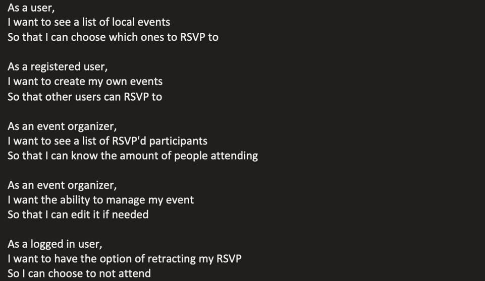
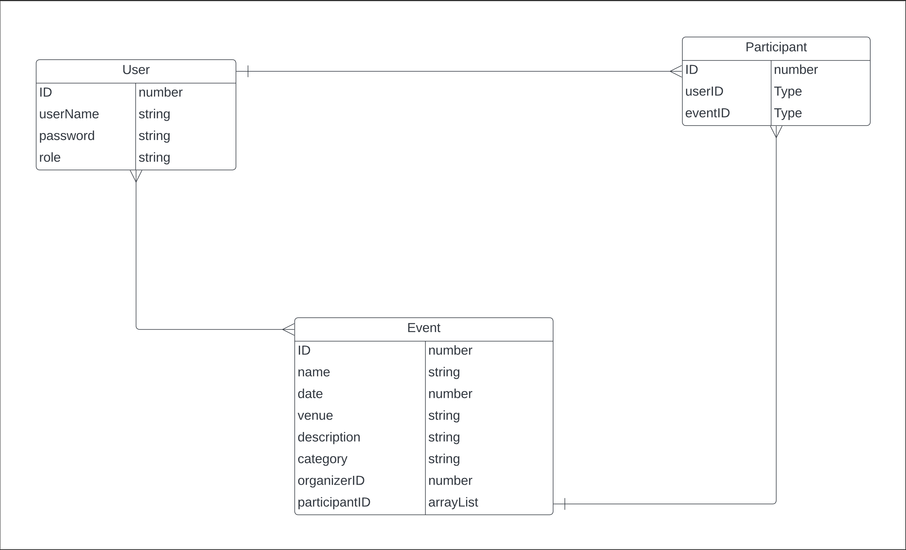

# Event Management Backend

## Project Description
The Event Management Backend is a robust and secure API developed using Spring Boot. It offers a comprehensive solution for managing events and attendees. Users can register, log in, create events, manage participants, and perform various operations on events and attendees. The API ensures security through JSON Web Tokens (JWT) for authentication and authorization.

Whether you're organizing conferences, workshops, or social gatherings, the Event Management Backend simplifies the process of managing events and attendees, allowing you to focus on creating memorable experiences.

## Table of Contents
- [Features](#features)
- [Project Approach](#project-approach)
- [Entity-Relationship Diagram (ERD)](#entity-relationship-diagram-erd)
- [Model View Controller Design (MVC)](#model-view-controller-design-mvc)
- [REST API Endpoints](#rest-api-endpoints)
- [Agile Development](#agile-development)
- [Tools and Technologies Used](#tools-and-technologies-used)
- [Hurdles Encountered During Development](#hurdles-encountered-during-development)
- [Installation Instructions](#installation-instructions)
- [Resources & Acknowledgements](#resources--acknowledgements)
- [Contributors](#contributors)

## Features
- User Authentication and Authorization
    - Register new users.
    - Login with email and password.
    - JWT-based authentication for enhanced security.
- Event and Participant Management
    - Create, update, and delete events.
    - Add and remove participants from events.
    - View participants of specific events.

## Project Approach
The Event Management Backend project follows a systematic and user-centric approach to deliver a seamless event management experience. Key components of my approach include:

### User-Centric Design
- Detailed user stories were crafted to capture essential user interactions.

 

- Features were designed with a focus on user experience and ease of use.

### Entity-Relationship Diagram (ERD)



- An ERD was created to design the database structure effectively.
- Relationships between entities like users, events, and participants were defined with:.

### Model View Controller Design (MVC)
- Follows the MVC architecture for separation of concerns.
- Requests are routed through controllers, processed by services, and interact with the database through repositories.

## REST API Endpoints
- **User Management:**
    - `POST /auth/users/register/`: Registers a new user with user data.
    - `POST /auth/users/login/`: Logs a user in.

- **Event Management:**
    - `POST /api/events/`: Creates a new event.
    - `GET /api/events/`: Gets all events.
    - `GET /api/events/{eventId}/`: Gets event details by ID.
    - `PUT /api/events/{eventId}/`: Updates an event by ID.
    - `DELETE /api/events/{eventId}/`: Deletes an event by ID.
    - `POST /api/events/{eventId}/participants/{participantId}/`: Adds a participant to an event.
    - `DELETE /api/events/{eventId}/participants/{participantId}/`: Removes a participant from an event.

| **Endpoint**                                            | **Description**                                  |
|---------------------------------------------------------|--------------------------------------------------|
| **User Management:**                                   |                                                  |
| `POST /auth/users/register/`                            | Registers a new user with user data.              |
| `POST /auth/users/login/`                               | Logs a user in.                                  |
| **Event Management:**                                  |                                                  
| `POST /api/events/`                                     | Creates a new event.                             |
| `GET /api/events/`                                      | Gets all events.                                 |
| `GET /api/events/{eventId}/`                            | Gets event details by ID.                        |
| `PUT /api/events/{eventId}/`                            | Updates an event by ID.                          |
| `DELETE /api/events/{eventId}/`                         | Deletes an event by ID.                          |
| `POST /api/events/{eventId}/participants/{participantId}/` | Adds a participant to an event.              |
| `DELETE /api/events/{eventId}/participants/{participantId}/`| Removes a participant from an event.        |

## Agile Development
- Agile methodologies were adopted for rapid development and adaptability.
- Project divided into phases with specific objectives.

## Tools and Technologies Used
- **Spring Boot**: Version 2.7.16 for backend development.
- **Maven**: Build automation tool and dependency management.
- **Spring Security**: Ensures data security and access control.
- **JWT Tokens**: Provides authentication and authorization.
- **H2 Database**: Manages data storage during development.
- **Cucumber JVM**: Testing framework for Behavior Driven Development.
- **GitHub**: Version control and collaboration platform.

## Hurdles Encountered During Development
### Unit test's<br>
I am a novice when it comes to testing and naturally I ran into some issues while using a TDD approach to this project.  One hurdle that I learned from was using application properties for my tests.  I needed my tests to have access to my jwt secret and expiration properties while I tested my security so learning to create testing configuration files so that my tests could run was enlightening.<br><br>

### Entity Relationships
The relationships of my entities changed during this process from what I initially envisioned.  Learning how to manage those relationships and how they affect each other was definitely a main hurdle throughout my development process for this project.  <br><br>
I learned about **Data Transfer Objects** and how beneficial they are when it comes to breaking the circular referencing of certain relationships. They are also beneficial for sending models of data to the front-end of an application.

- **Why do we need DTOs?**<br>
They help with transferring data between different parts of a pargram and between systems. Transferring database entities directly is not always a good practice due to varrious reasons such as security, performance, and data encapsulation.<br><br>

- **What are DTOs?**<br>
Data objects that carry data between processes or layers in an application. It's important to select only the necessary fields you are going to transfer. 

## Installation Instructions
1. **Install Maven**: Ensure Maven is installed on your system.
```bash
   mvn -v 
   ```
   If not installed, download and install it from the [official Apache Maven website](https://maven.apache.org/download.cgi).

2. **Navigate to Project Directory**: Go to the project's root directory where `pom.xml` is located.

3. **Install Dependencies**: Run the following Maven command to download and install project dependencies.
```bash
   mvn clean install
   ```

## Resources & Acknowledgements
### General Assembly Instructors
- Suresh Sigera: [GitHub](https://github.com/sureshSigera)
- Dhrubo Chowdhury: [GitHub](https://github.com/DhruboChowdhury)
- Leonardo Rodriguez: [GitHub](https://github.com/LeonardoRMR)

### Links:
- [JSON Authentication Token](https://jwt.io/)
- [Spring Framework Documentation](https://spring.io/projects/spring-framework)
- [MVN Repository](https://mvnrepository.com/)

## Contributors
- **Rick Maya**: [GitHub](https://github.com/RickMMaya) | [LinkedIn](https://www.linkedin.com/in/rickmaya/)
